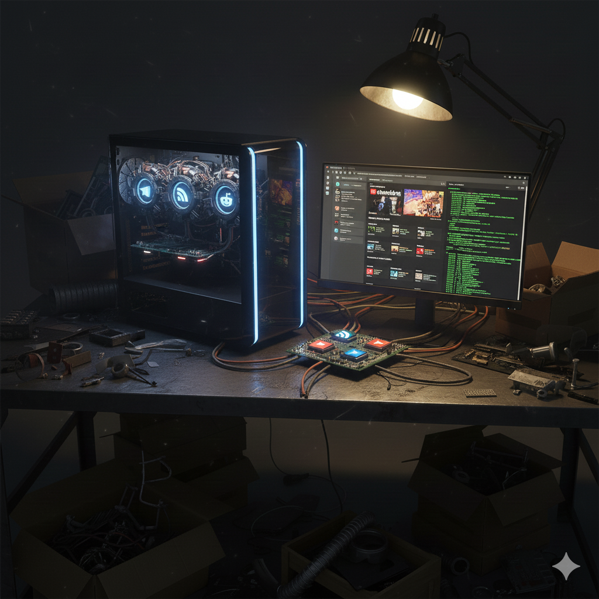
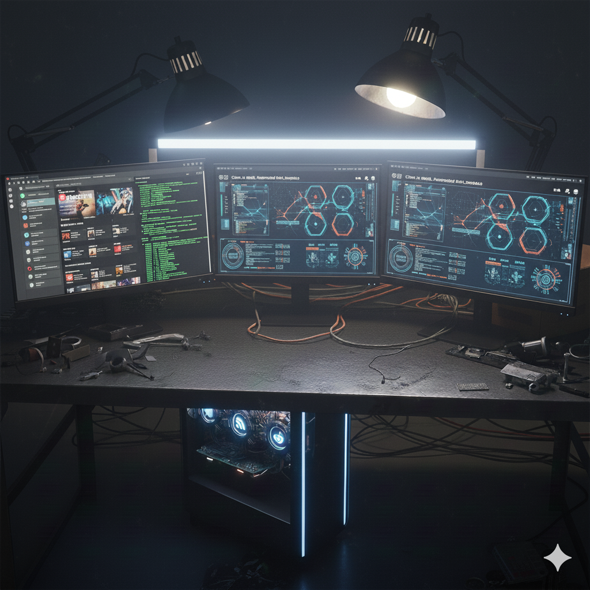

# I.N.S.I.G.H.T. Mark V - Frontier


Fully Dockered applicaiton to run with single command for production.


## Local Usage

For Telegram RSS use:
- https://github.com/xtrime-ru/TelegramRSS

(I reccommend using rss over standard api, because it is more stable and reliable)

For Twitter RSS use:
- https://github.com/sekai-soft/guide-nitter-self-hosting

## Installation

```
cp .env.example .env
```

Edit the `.env` file with actual credentials

## Docker Installation


# Evolution visually


Mark I - only Telegram connector


Mark II - New connectors


Mark III - Unified Data model and renderers


Mark IV - Gemini integration and briefing


Mark V - Web interface
